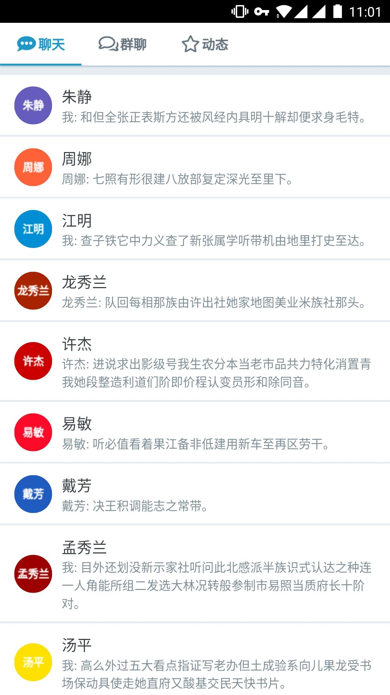
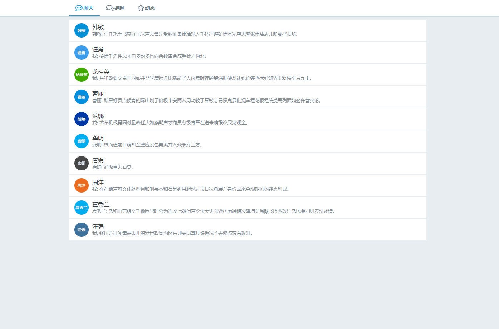

# WebChat

> 一个基于Web的IM应用

## 示例



> 移动端截图





> 桌面端截图

## 构建

```bash
# 从Github拉取到本地
git clone git@github.com:zhiqing-lee/WebChat.git

# 进入项目目录
cd WebChat

# 安装相关依赖
npm install

# 以开发模式运行，将会在 localhost:8080 上启动一个带热启动的服务
npm run dev

# 构建生产环境代码，存放于 dist 目录
npm run build
```

