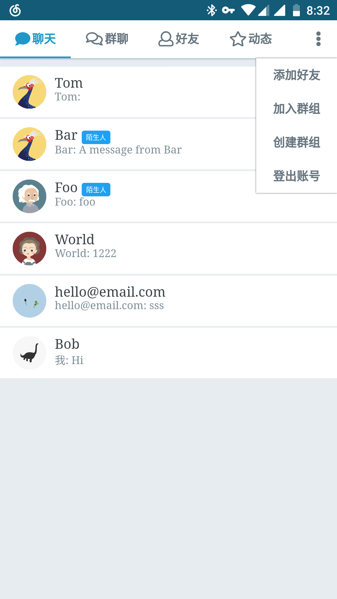
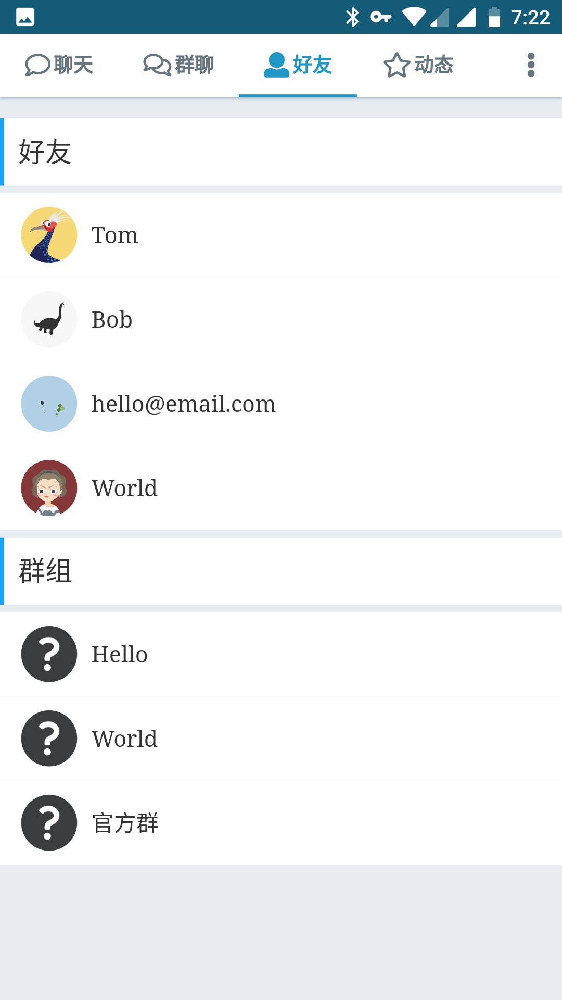
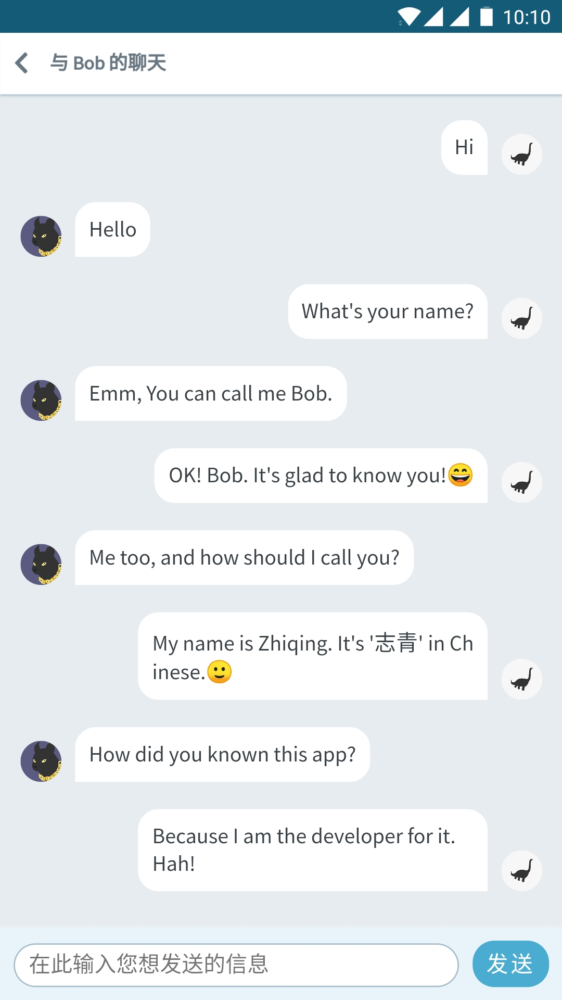
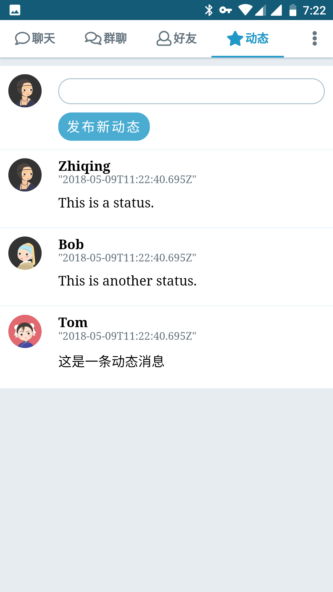
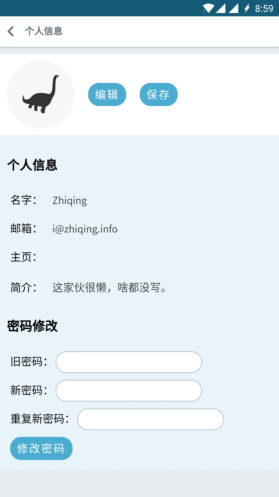
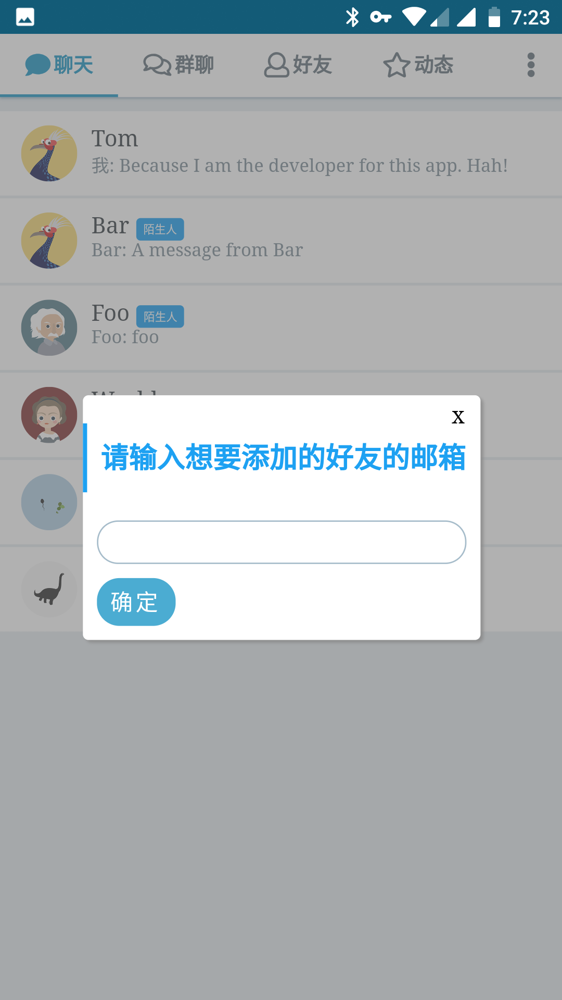

# WebChat

> 一个基于Web的IM应用

## 截图





> 移动端截图


> 桌面端截图

## 构建

> 主机上需装有 Nodejs 与 Docker

```bash
# 从Github拉取到本地
git clone git@github.com:zhiqing-lee/WebChat.git

# 进入项目目录
cd WebChat

# 安装相关依赖
npm install

# 安装服务器模块依赖
cd server && npm install && cd ..

# 运行
npm run docker
```

